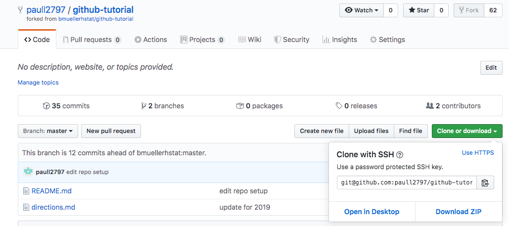

# GitHub Tutorial

_by Paul Liu_

---
## Git vs. GitHub

Git is the version control, which keeps snapshots of the code. Git doesn't need Github. Github stores code, tracks changes made, and used to collaborate on files. Github needs Git to work.

---
## Initial Setup

Before you start using Github, you have to create an account. Go to [Github](https://github.com/) and click sign up. If you're an HSTAT student, it is recommended to use your HSTAT email (without the @hstat.org) as your username. Now that you've created your github account, you can use the [IDE](https://ide.cs50.io/). Make sure to use the SSH key, so the website doesn't keep asking for your login information.

---
## Repository Setup

In order to start using git, you first have to do `git init`, which turns the directory into a repository. You only have to do this once. Before you can commit, you must have editted a file beforehand. You can create a file by using `touch (filename)` and open it with `c9 (filename)`. Make sure to save your changes! Before you can push your changes to Github, you need to set up a remote. Follow the steps below.
  
1. Go to [Github](github.com) 
2. Select your repo
3. Select clone and download
4. Make sure it says "Clone with SSH" (to change click use SSH)

(It should look something like this)
5. Copy the link and go back to your IDE
6. Do `git remote add origin (URL)` (The URL should be the link from step 5)
7. Do `git push -u origin master`
8. Afterwards, you only have to do `git push` to push your changes.
---
## Workflow & Commands

* Use `git status` to see which files that changed since the last commit
* Use `git add .`` to add changes you made to the stage, which allows you to commit it.
* Use `git commit -m "(message)" ` to take a screenshot of the files on stage. The message is used to find the commit. Make sure the message describes what the screenshot is about.
* Use `git push` to push your changes to the remote repository.

---
## Rolling Back Changes

### _Undoing Edits_  
If you ever make a mistake when messing around with files, you can do `git checkout -- (FILE_NAME)` to revert the edits you've made.

### _Undoing Git Adds_  
If you accidently added a file(s) that you weren't trying to, you can always use git status to find the git command to help you. The command is usually `git reset HEAD (FILE_NAME)` to unstage the file.

### _Undoing Commits_  
If you want to undo a commit, you can use `git reset --soft HEAD~1`. This will only leave your files and staging area alone, while undoing the commit.
